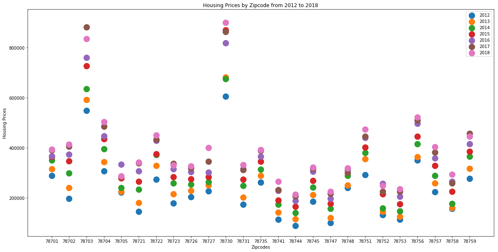

```python
# Dependencies
import numpy as np
import pandas as pd
import matplotlib.pyplot as plt
import requests
import os

```


```python
raw_df = pd.read_csv("housing_prices.csv")
raw_df.head()
```


<div>
<style scoped>
    .dataframe tbody tr th:only-of-type {
        vertical-align: middle;
    }

    .dataframe tbody tr th {
        vertical-align: top;
    }

    .dataframe thead th {
        text-align: right;
    }
</style>
<table border="1" class="dataframe">
  <thead>
    <tr style="text-align: right;">
      <th></th>
      <th>Region</th>
      <th>Zipcode</th>
      <th>Month of Period End</th>
      <th>Year</th>
      <th>Median Sale Price</th>
      <th>Median Sale Price MoM</th>
      <th>Median Sale Price YoY</th>
      <th>Homes Sold</th>
      <th>Homes Sold MoM</th>
      <th>Homes Sold YoY</th>
      <th>...</th>
      <th>New Listings YoY</th>
      <th>Inventory</th>
      <th>Inventory MoM</th>
      <th>Inventory YoY</th>
      <th>Days on Market</th>
      <th>Days on Market MoM</th>
      <th>Days on Market YoY</th>
      <th>Average Sale To List</th>
      <th>Average Sale To List MoM</th>
      <th>Average Sale To List YoY</th>
    </tr>
  </thead>
  <tbody>
    <tr>
      <th>0</th>
      <td>Austin, TX - Allandale</td>
      <td>78756</td>
      <td>12-Jan</td>
      <td>2012</td>
      <td>315000</td>
      <td>-6.30%</td>
      <td>7.70%</td>
      <td>35</td>
      <td>6.10%</td>
      <td>-7.90%</td>
      <td>...</td>
      <td>5.60%</td>
      <td>41.0</td>
      <td>7.90%</td>
      <td>-10.90%</td>
      <td>56.0</td>
      <td>5.0</td>
      <td>0.0</td>
      <td>95.00%</td>
      <td>-0.60%</td>
      <td>-1.10%</td>
    </tr>
    <tr>
      <th>1</th>
      <td>Austin, TX - Allandale</td>
      <td>78756</td>
      <td>12-Feb</td>
      <td>2012</td>
      <td>315000</td>
      <td>-0.20%</td>
      <td>6.30%</td>
      <td>35</td>
      <td>0.00%</td>
      <td>2.90%</td>
      <td>...</td>
      <td>17.40%</td>
      <td>44.0</td>
      <td>7.30%</td>
      <td>-6.40%</td>
      <td>56.0</td>
      <td>0.0</td>
      <td>9.0</td>
      <td>95.30%</td>
      <td>0.30%</td>
      <td>-1.00%</td>
    </tr>
    <tr>
      <th>2</th>
      <td>Austin, TX - Allandale</td>
      <td>78756</td>
      <td>12-Mar</td>
      <td>2012</td>
      <td>322000</td>
      <td>2.30%</td>
      <td>8.40%</td>
      <td>42</td>
      <td>20.00%</td>
      <td>20.00%</td>
      <td>...</td>
      <td>22.80%</td>
      <td>43.0</td>
      <td>-2.30%</td>
      <td>2.40%</td>
      <td>42.0</td>
      <td>-14.0</td>
      <td>6.0</td>
      <td>95.90%</td>
      <td>0.60%</td>
      <td>-0.40%</td>
    </tr>
    <tr>
      <th>3</th>
      <td>Austin, TX - Allandale</td>
      <td>78756</td>
      <td>12-Apr</td>
      <td>2012</td>
      <td>346000</td>
      <td>7.40%</td>
      <td>9.00%</td>
      <td>56</td>
      <td>33.30%</td>
      <td>24.40%</td>
      <td>...</td>
      <td>16.90%</td>
      <td>38.0</td>
      <td>-11.60%</td>
      <td>-15.60%</td>
      <td>33.0</td>
      <td>-9.0</td>
      <td>1.0</td>
      <td>97.00%</td>
      <td>1.10%</td>
      <td>0.10%</td>
    </tr>
    <tr>
      <th>4</th>
      <td>Austin, TX - Allandale</td>
      <td>78756</td>
      <td>12-May</td>
      <td>2012</td>
      <td>360000</td>
      <td>4.10%</td>
      <td>9.90%</td>
      <td>64</td>
      <td>14.30%</td>
      <td>45.50%</td>
      <td>...</td>
      <td>37.90%</td>
      <td>37.0</td>
      <td>-2.60%</td>
      <td>-7.50%</td>
      <td>21.0</td>
      <td>-12.0</td>
      <td>-11.0</td>
      <td>97.50%</td>
      <td>0.50%</td>
      <td>0.70%</td>
    </tr>
  </tbody>
</table>
<p>5 rows × 22 columns</p>
</div>


```python
zips = raw_df['Zipcode'].unique()
zips

final_zip = zips.astype(str)
final_zip

median = raw_df.groupby(["Year","Zipcode"])["Median Sale Price"].mean().reset_index()
median["Median Sale Price"] = median["Median Sale Price"].apply(lambda x: round(x,0))
median["Zipcode"]= median["Zipcode"].astype(str)
median["Year"]= median["Year"].astype(str)
median.dtypes
```


    Year                  object
    Zipcode               object
    Median Sale Price    float64
    dtype: object


```python
Y2012_df = median[median["Year"] == "2012"]
Y2013_df = median[median["Year"] == "2013"]
Y2014_df = median[median["Year"] == "2014"]
Y2015_df = median[median["Year"] == "2015"]
Y2016_df = median[median["Year"] == "2016"]
Y2017_df = median[median["Year"] == "2017"]
Y2018_df = median[median["Year"] == "2018"]

plt.figure(figsize=(20,10))
#plotting
plt.scatter(Y2012_df["Zipcode"], 
            Y2012_df["Median Sale Price"],
            s=200)

plt.scatter(Y2013_df["Zipcode"], 
            Y2013_df["Median Sale Price"],
            s=200)

plt.scatter(Y2014_df["Zipcode"], 
            Y2014_df["Median Sale Price"],
            s=200)

plt.scatter(Y2015_df["Zipcode"], 
            Y2015_df["Median Sale Price"],
            s=200)

plt.scatter(Y2016_df["Zipcode"], 
            Y2016_df["Median Sale Price"],
            s=200)

plt.scatter(Y2017_df["Zipcode"], 
            Y2017_df["Median Sale Price"],
            s=200)

plt.scatter(Y2018_df["Zipcode"], 
            Y2018_df["Median Sale Price"],
            s=200)

years = [2012, 2013, 2014, 2015, 2016, 2017, 2018]
plt.legend(years)
plt.ylabel("Housing Prices")
plt.xlabel("Zipcodes")
plt.title("Housing Prices by Zipcode from 2012 to 2018")
plt.show()

```





```python
# zips = raw_df['Zipcode'].unique()
# zips

# #pd.DataFrame.astype(dtype='str')#, copy=True, errors='raise')#, **kwargs)
# final_zip = zips.astype(str)
# final_zippl
```


```python
# # # Incorporate the other graph properties
# #now = datetime.now()
# #now = now.strftime("%m-%d-%y")
# plt.title(f"Prices by Zipcode from 2012 to 2018")
# #from matplotlib import pylab
# #pylab.legend(target_user, loc="upper center", bbox_to_anchor=(1.10,1.05))

```
