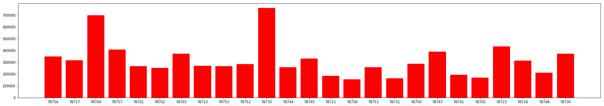

# Housing Prices by Zip Code YoY


```python
# Dependencies
import numpy as np
import pandas as pd
import matplotlib.pyplot as plt
import requests
import os

```


```python
raw_df = pd.read_csv("housing_prices.csv")
raw_df.head()
```


<div>
<style scoped>
    .dataframe tbody tr th:only-of-type {
        vertical-align: middle;
    }

    .dataframe tbody tr th {
        vertical-align: top;
    }

    .dataframe thead th {
        text-align: right;
    }
</style>
<table border="1" class="dataframe">
  <thead>
    <tr style="text-align: right;">
      <th></th>
      <th>Region</th>
      <th>Zipcode</th>
      <th>Month of Period End</th>
      <th>Year</th>
      <th>Median Sale Price</th>
      <th>Median Sale Price MoM</th>
      <th>Median Sale Price YoY</th>
      <th>Homes Sold</th>
      <th>Homes Sold MoM</th>
      <th>Homes Sold YoY</th>
      <th>...</th>
      <th>New Listings YoY</th>
      <th>Inventory</th>
      <th>Inventory MoM</th>
      <th>Inventory YoY</th>
      <th>Days on Market</th>
      <th>Days on Market MoM</th>
      <th>Days on Market YoY</th>
      <th>Average Sale To List</th>
      <th>Average Sale To List MoM</th>
      <th>Average Sale To List YoY</th>
    </tr>
  </thead>
  <tbody>
    <tr>
      <th>0</th>
      <td>Austin, TX - Allandale</td>
      <td>78756</td>
      <td>12-Jan</td>
      <td>2012</td>
      <td>315000</td>
      <td>-6.30%</td>
      <td>7.70%</td>
      <td>35</td>
      <td>6.10%</td>
      <td>-7.90%</td>
      <td>...</td>
      <td>5.60%</td>
      <td>41.0</td>
      <td>7.90%</td>
      <td>-10.90%</td>
      <td>56.0</td>
      <td>5.0</td>
      <td>0.0</td>
      <td>95.00%</td>
      <td>-0.60%</td>
      <td>-1.10%</td>
    </tr>
    <tr>
      <th>1</th>
      <td>Austin, TX - Allandale</td>
      <td>78756</td>
      <td>12-Feb</td>
      <td>2012</td>
      <td>315000</td>
      <td>-0.20%</td>
      <td>6.30%</td>
      <td>35</td>
      <td>0.00%</td>
      <td>2.90%</td>
      <td>...</td>
      <td>17.40%</td>
      <td>44.0</td>
      <td>7.30%</td>
      <td>-6.40%</td>
      <td>56.0</td>
      <td>0.0</td>
      <td>9.0</td>
      <td>95.30%</td>
      <td>0.30%</td>
      <td>-1.00%</td>
    </tr>
    <tr>
      <th>2</th>
      <td>Austin, TX - Allandale</td>
      <td>78756</td>
      <td>12-Mar</td>
      <td>2012</td>
      <td>322000</td>
      <td>2.30%</td>
      <td>8.40%</td>
      <td>42</td>
      <td>20.00%</td>
      <td>20.00%</td>
      <td>...</td>
      <td>22.80%</td>
      <td>43.0</td>
      <td>-2.30%</td>
      <td>2.40%</td>
      <td>42.0</td>
      <td>-14.0</td>
      <td>6.0</td>
      <td>95.90%</td>
      <td>0.60%</td>
      <td>-0.40%</td>
    </tr>
    <tr>
      <th>3</th>
      <td>Austin, TX - Allandale</td>
      <td>78756</td>
      <td>12-Apr</td>
      <td>2012</td>
      <td>346000</td>
      <td>7.40%</td>
      <td>9.00%</td>
      <td>56</td>
      <td>33.30%</td>
      <td>24.40%</td>
      <td>...</td>
      <td>16.90%</td>
      <td>38.0</td>
      <td>-11.60%</td>
      <td>-15.60%</td>
      <td>33.0</td>
      <td>-9.0</td>
      <td>1.0</td>
      <td>97.00%</td>
      <td>1.10%</td>
      <td>0.10%</td>
    </tr>
    <tr>
      <th>4</th>
      <td>Austin, TX - Allandale</td>
      <td>78756</td>
      <td>12-May</td>
      <td>2012</td>
      <td>360000</td>
      <td>4.10%</td>
      <td>9.90%</td>
      <td>64</td>
      <td>14.30%</td>
      <td>45.50%</td>
      <td>...</td>
      <td>37.90%</td>
      <td>37.0</td>
      <td>-2.60%</td>
      <td>-7.50%</td>
      <td>21.0</td>
      <td>-12.0</td>
      <td>-11.0</td>
      <td>97.50%</td>
      <td>0.50%</td>
      <td>0.70%</td>
    </tr>
  </tbody>
</table>
<p>5 rows × 22 columns</p>
</div>


```python
#prices_groups = pd.DataFrame(raw_df.groupby(['Zipcode']).mean())
#median_price = pd.DataFrame(prices_groups['Median Sale Price'].unique())
#median_price
```


```python
prices = raw_df.groupby(['Zipcode'])['Median Sale Price'].mean()
prices

```


    Zipcode
    78701    348565.789474
    78702    315975.328947
    78703    697640.350877
    78704    407497.607656
    78705    265328.947368
    78721    250338.815789
    78722    372789.473684
    78723    268232.456140
    78726    267236.842105
    78727    285309.210526
    78730    759342.105263
    78731    258289.473684
    78735    330536.184211
    78741    184728.070175
    78744    154388.157895
    78745    258396.825397
    78747    164855.263158
    78748    287770.270270
    78751    390171.052632
    78752    192092.920354
    78753    169376.315789
    78756    434859.649123
    78757    311868.421053
    78758    212078.947368
    78759    373333.333333
    Name: Median Sale Price, dtype: float64


```python
zips = raw_df['Zipcode'].unique()
zips

final_zip = zips.astype(str)
final_zip
```


    array(['78756', '78727', '78704', '78757', '78701', '78702', '78703',
           '78722', '78753', '78752', '78735', '78744', '78745', '78721',
           '78758', '78751', '78731', '78759', '78747', '78741', '78705',
           '78723', '78726', '78748', '78730'], dtype='<U21')


```python
# Give our graph axis labels
#plt.xlabel("")
#plt.ylabel("How Cool MatPlotLib Seems")

# Have to plot our chart once again as it doesn't stick after being shown
#plt.plot(x_axis, e_x)
#plt.show()
```


```python
#zip_codes = pd.DataFrame(raw_df["Zipcode"].unique())

#z = tuple(zip_codes)
#zip_codes

plt.figure(figsize=(30,5))   
plt.bar(final_zip, prices,  width=.8, color="red", align='center', alpha=1) 


```


    <BarContainer object of 25 artists>




