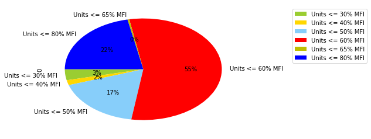

# Median Family Income Analysis


```python
#Import Dependencies
import pandas as pd
pd.options.display.float_format = '{:.0f}'.format
from matplotlib import pylab
import numpy as np
import matplotlib.pyplot as plt
import matplotlib.patches as mpatches
import csv
from functools import reduce

```


```python
#Read csv file, create DF
AHI_df = pd.read_csv('1 - Raw Data/AHI_DATA.csv')

#Select applicable fields for analysis
AHI_df = AHI_df[['Zip Code','Unit Type', 'Housing Type', 'Status','Affordability Start Year', 'Units <= 30% MFI','Units <= 40% MFI',
                'Units <= 50% MFI', 'Units <= 60% MFI', 'Units <= 65% MFI','Units <= 80% MFI']]

#filter projects to only completed projects and unit types - single and multifamily since they represent 93% of data
filtered_AHI_df = AHI_df[(AHI_df['Unit Type']=='Single Family')|
                                  (AHI_df['Unit Type']=='Multifamily')]

filtered_AHI_df = AHI_df[(AHI_df['Affordability Start Year']>=2012)]

#remove rows without zip codes
filtered_AHI_df['Zip Code'].replace('  ', np.nan, inplace=True)
clean_df= filtered_AHI_df.dropna(subset=['Zip Code'])


#calculate median family income 
sum_30_MFI = clean_df['Units <= 30% MFI'].sum()
sum_40_MFI = clean_df['Units <= 40% MFI'].sum()
sum_50_MFI = clean_df['Units <= 50% MFI'].sum()
sum_60_MFI = clean_df['Units <= 60% MFI'].sum()
sum_65_MFI = clean_df['Units <= 65% MFI'].sum()

#convert datatype to integer to enable sum function
clean_df['Units <= 80% MFI'] = clean_df['Units <= 80% MFI'].astype(np.int64)
sum_80_MFI = clean_df['Units <= 80% MFI'].sum()
clean_df

```

    /Users/evertlizama/anaconda3/lib/python3.6/site-packages/pandas/core/generic.py:3924: SettingWithCopyWarning: 
    A value is trying to be set on a copy of a slice from a DataFrame
    
    See the caveats in the documentation: http://pandas.pydata.org/pandas-docs/stable/indexing.html#indexing-view-versus-copy
      self._update_inplace(new_data)
    /Users/evertlizama/anaconda3/lib/python3.6/site-packages/ipykernel_launcher.py:28: SettingWithCopyWarning: 
    A value is trying to be set on a copy of a slice from a DataFrame.
    Try using .loc[row_indexer,col_indexer] = value instead
    
    See the caveats in the documentation: http://pandas.pydata.org/pandas-docs/stable/indexing.html#indexing-view-versus-copy


<div>
<style>
    .dataframe thead tr:only-child th {
        text-align: right;
    }

    .dataframe thead th {
        text-align: left;
    }

    .dataframe tbody tr th {
        vertical-align: top;
    }
</style>
<table border="1" class="dataframe">
  <thead>
    <tr style="text-align: right;">
      <th></th>
      <th>Zip Code</th>
      <th>Unit Type</th>
      <th>Housing Type</th>
      <th>Status</th>
      <th>Affordability Start Year</th>
      <th>Units &lt;= 30% MFI</th>
      <th>Units &lt;= 40% MFI</th>
      <th>Units &lt;= 50% MFI</th>
      <th>Units &lt;= 60% MFI</th>
      <th>Units &lt;= 65% MFI</th>
      <th>Units &lt;= 80% MFI</th>
    </tr>
  </thead>
  <tbody>
    <tr>
      <th>4</th>
      <td>78724</td>
      <td>Single Family</td>
      <td>Ownership</td>
      <td>Project Complete</td>
      <td>2012</td>
      <td>0</td>
      <td>0</td>
      <td>0</td>
      <td>0</td>
      <td>0</td>
      <td>1</td>
    </tr>
    <tr>
      <th>5</th>
      <td>78724</td>
      <td>Single Family</td>
      <td>Ownership</td>
      <td>Project Complete</td>
      <td>2013</td>
      <td>0</td>
      <td>0</td>
      <td>0</td>
      <td>0</td>
      <td>0</td>
      <td>1</td>
    </tr>
    <tr>
      <th>6</th>
      <td>78724</td>
      <td>Single Family</td>
      <td>Ownership</td>
      <td>Project Complete</td>
      <td>2013</td>
      <td>0</td>
      <td>0</td>
      <td>0</td>
      <td>0</td>
      <td>0</td>
      <td>1</td>
    </tr>
    <tr>
      <th>7</th>
      <td>78724</td>
      <td>Single Family</td>
      <td>Ownership</td>
      <td>Project Complete</td>
      <td>2013</td>
      <td>0</td>
      <td>0</td>
      <td>0</td>
      <td>0</td>
      <td>0</td>
      <td>1</td>
    </tr>
    <tr>
      <th>8</th>
      <td>78724</td>
      <td>Single Family</td>
      <td>Ownership</td>
      <td>Project Complete</td>
      <td>2013</td>
      <td>0</td>
      <td>0</td>
      <td>0</td>
      <td>0</td>
      <td>0</td>
      <td>1</td>
    </tr>
    <tr>
      <th>9</th>
      <td>78724</td>
      <td>Single Family</td>
      <td>Ownership</td>
      <td>Project Complete</td>
      <td>2013</td>
      <td>0</td>
      <td>0</td>
      <td>0</td>
      <td>0</td>
      <td>0</td>
      <td>1</td>
    </tr>
    <tr>
      <th>10</th>
      <td>78724</td>
      <td>Single Family</td>
      <td>Ownership</td>
      <td>Project Complete</td>
      <td>2013</td>
      <td>0</td>
      <td>0</td>
      <td>0</td>
      <td>0</td>
      <td>0</td>
      <td>1</td>
    </tr>
    <tr>
      <th>11</th>
      <td>78724</td>
      <td>Single Family</td>
      <td>Ownership</td>
      <td>Project Complete</td>
      <td>2013</td>
      <td>0</td>
      <td>0</td>
      <td>0</td>
      <td>0</td>
      <td>0</td>
      <td>1</td>
    </tr>
    <tr>
      <th>12</th>
      <td>78724</td>
      <td>Single Family</td>
      <td>Ownership</td>
      <td>Project Complete</td>
      <td>2013</td>
      <td>0</td>
      <td>0</td>
      <td>0</td>
      <td>0</td>
      <td>0</td>
      <td>1</td>
    </tr>
    <tr>
      <th>13</th>
      <td>78724</td>
      <td>Single Family</td>
      <td>Ownership</td>
      <td>Project Complete</td>
      <td>2014</td>
      <td>0</td>
      <td>0</td>
      <td>0</td>
      <td>0</td>
      <td>0</td>
      <td>1</td>
    </tr>
    <tr>
      <th>14</th>
      <td>78724</td>
      <td>Single Family</td>
      <td>Ownership</td>
      <td>Project Complete</td>
      <td>2014</td>
      <td>0</td>
      <td>0</td>
      <td>0</td>
      <td>0</td>
      <td>0</td>
      <td>1</td>
    </tr>
    <tr>
      <th>15</th>
      <td>78724</td>
      <td>Single Family</td>
      <td>Ownership</td>
      <td>Project Complete</td>
      <td>2014</td>
      <td>0</td>
      <td>0</td>
      <td>0</td>
      <td>0</td>
      <td>0</td>
      <td>1</td>
    </tr>
    <tr>
      <th>16</th>
      <td>78724</td>
      <td>Single Family</td>
      <td>Ownership</td>
      <td>Project Complete</td>
      <td>2014</td>
      <td>0</td>
      <td>0</td>
      <td>0</td>
      <td>0</td>
      <td>0</td>
      <td>1</td>
    </tr>
    <tr>
      <th>17</th>
      <td>78724</td>
      <td>Single Family</td>
      <td>Ownership</td>
      <td>Project Complete</td>
      <td>2014</td>
      <td>0</td>
      <td>0</td>
      <td>0</td>
      <td>0</td>
      <td>0</td>
      <td>1</td>
    </tr>
    <tr>
      <th>18</th>
      <td>78724</td>
      <td>Single Family</td>
      <td>Ownership</td>
      <td>Project Complete</td>
      <td>2014</td>
      <td>0</td>
      <td>0</td>
      <td>0</td>
      <td>0</td>
      <td>0</td>
      <td>1</td>
    </tr>
    <tr>
      <th>19</th>
      <td>78724</td>
      <td>Single Family</td>
      <td>Ownership</td>
      <td>Project Complete</td>
      <td>2014</td>
      <td>0</td>
      <td>0</td>
      <td>0</td>
      <td>0</td>
      <td>0</td>
      <td>1</td>
    </tr>
    <tr>
      <th>20</th>
      <td>78724</td>
      <td>Single Family</td>
      <td>Ownership</td>
      <td>Project Complete</td>
      <td>2014</td>
      <td>0</td>
      <td>0</td>
      <td>0</td>
      <td>0</td>
      <td>0</td>
      <td>1</td>
    </tr>
    <tr>
      <th>21</th>
      <td>78724</td>
      <td>Single Family</td>
      <td>Ownership</td>
      <td>Project Complete</td>
      <td>2014</td>
      <td>0</td>
      <td>0</td>
      <td>0</td>
      <td>0</td>
      <td>0</td>
      <td>1</td>
    </tr>
    <tr>
      <th>22</th>
      <td>78724</td>
      <td>Single Family</td>
      <td>Ownership</td>
      <td>Project Complete</td>
      <td>2014</td>
      <td>0</td>
      <td>0</td>
      <td>0</td>
      <td>0</td>
      <td>0</td>
      <td>1</td>
    </tr>
    <tr>
      <th>23</th>
      <td>78724</td>
      <td>Single Family</td>
      <td>Ownership</td>
      <td>Project Complete</td>
      <td>2014</td>
      <td>0</td>
      <td>0</td>
      <td>0</td>
      <td>0</td>
      <td>0</td>
      <td>1</td>
    </tr>
    <tr>
      <th>24</th>
      <td>78724</td>
      <td>Single Family</td>
      <td>Ownership</td>
      <td>Project Complete</td>
      <td>2012</td>
      <td>0</td>
      <td>0</td>
      <td>0</td>
      <td>0</td>
      <td>0</td>
      <td>1</td>
    </tr>
    <tr>
      <th>25</th>
      <td>78724</td>
      <td>Single Family</td>
      <td>Ownership</td>
      <td>Project Complete</td>
      <td>2012</td>
      <td>0</td>
      <td>0</td>
      <td>0</td>
      <td>0</td>
      <td>0</td>
      <td>1</td>
    </tr>
    <tr>
      <th>26</th>
      <td>78724</td>
      <td>Single Family</td>
      <td>Ownership</td>
      <td>Project Complete</td>
      <td>2012</td>
      <td>0</td>
      <td>0</td>
      <td>0</td>
      <td>0</td>
      <td>0</td>
      <td>1</td>
    </tr>
    <tr>
      <th>27</th>
      <td>78724</td>
      <td>Single Family</td>
      <td>Ownership</td>
      <td>Project Complete</td>
      <td>2012</td>
      <td>0</td>
      <td>0</td>
      <td>0</td>
      <td>0</td>
      <td>0</td>
      <td>1</td>
    </tr>
    <tr>
      <th>28</th>
      <td>78724</td>
      <td>Single Family</td>
      <td>Ownership</td>
      <td>Project Complete</td>
      <td>2012</td>
      <td>0</td>
      <td>0</td>
      <td>0</td>
      <td>0</td>
      <td>0</td>
      <td>1</td>
    </tr>
    <tr>
      <th>29</th>
      <td>78724</td>
      <td>Single Family</td>
      <td>Ownership</td>
      <td>Project Complete</td>
      <td>2012</td>
      <td>0</td>
      <td>0</td>
      <td>0</td>
      <td>0</td>
      <td>0</td>
      <td>1</td>
    </tr>
    <tr>
      <th>30</th>
      <td>78724</td>
      <td>Single Family</td>
      <td>Ownership</td>
      <td>Project Complete</td>
      <td>2012</td>
      <td>0</td>
      <td>0</td>
      <td>0</td>
      <td>0</td>
      <td>0</td>
      <td>1</td>
    </tr>
    <tr>
      <th>31</th>
      <td>78724</td>
      <td>Single Family</td>
      <td>Ownership</td>
      <td>Project Complete</td>
      <td>2012</td>
      <td>0</td>
      <td>0</td>
      <td>0</td>
      <td>0</td>
      <td>0</td>
      <td>1</td>
    </tr>
    <tr>
      <th>32</th>
      <td>78724</td>
      <td>Single Family</td>
      <td>Ownership</td>
      <td>Project Complete</td>
      <td>2012</td>
      <td>0</td>
      <td>0</td>
      <td>0</td>
      <td>0</td>
      <td>0</td>
      <td>1</td>
    </tr>
    <tr>
      <th>33</th>
      <td>78724</td>
      <td>Single Family</td>
      <td>Ownership</td>
      <td>Project Complete</td>
      <td>2012</td>
      <td>0</td>
      <td>0</td>
      <td>0</td>
      <td>0</td>
      <td>0</td>
      <td>1</td>
    </tr>
    <tr>
      <th>...</th>
      <td>...</td>
      <td>...</td>
      <td>...</td>
      <td>...</td>
      <td>...</td>
      <td>...</td>
      <td>...</td>
      <td>...</td>
      <td>...</td>
      <td>...</td>
      <td>...</td>
    </tr>
    <tr>
      <th>501</th>
      <td>78723</td>
      <td>Multifamily</td>
      <td>Rental</td>
      <td>Project Complete</td>
      <td>2017</td>
      <td>0</td>
      <td>0</td>
      <td>0</td>
      <td>292</td>
      <td>0</td>
      <td>0</td>
    </tr>
    <tr>
      <th>502</th>
      <td>78705</td>
      <td>Multifamily</td>
      <td>Rental</td>
      <td>Project Complete</td>
      <td>2013</td>
      <td>0</td>
      <td>0</td>
      <td>0</td>
      <td>0</td>
      <td>0</td>
      <td>14</td>
    </tr>
    <tr>
      <th>504</th>
      <td>78723</td>
      <td>Multifamily</td>
      <td>Rental</td>
      <td>Project Complete</td>
      <td>2014</td>
      <td>0</td>
      <td>0</td>
      <td>0</td>
      <td>0</td>
      <td>0</td>
      <td>30</td>
    </tr>
    <tr>
      <th>507</th>
      <td>78748</td>
      <td>Multifamily</td>
      <td>Rental</td>
      <td>Project Complete</td>
      <td>2013</td>
      <td>14</td>
      <td>0</td>
      <td>70</td>
      <td>42</td>
      <td>0</td>
      <td>0</td>
    </tr>
    <tr>
      <th>510</th>
      <td>78705</td>
      <td>Multifamily</td>
      <td>Rental</td>
      <td>Project Complete</td>
      <td>2015</td>
      <td>0</td>
      <td>0</td>
      <td>0</td>
      <td>0</td>
      <td>0</td>
      <td>12</td>
    </tr>
    <tr>
      <th>515</th>
      <td>78702</td>
      <td>Multifamily</td>
      <td>Rental</td>
      <td>Project Complete</td>
      <td>2017</td>
      <td>0</td>
      <td>0</td>
      <td>51</td>
      <td>0</td>
      <td>0</td>
      <td>0</td>
    </tr>
    <tr>
      <th>516</th>
      <td>78704</td>
      <td>Multifamily</td>
      <td>Ownership</td>
      <td>Project Complete</td>
      <td>2017</td>
      <td>0</td>
      <td>0</td>
      <td>0</td>
      <td>0</td>
      <td>0</td>
      <td>1</td>
    </tr>
    <tr>
      <th>524</th>
      <td>78722</td>
      <td>Single Family</td>
      <td>Rental</td>
      <td>Project Complete</td>
      <td>2014</td>
      <td>0</td>
      <td>0</td>
      <td>1</td>
      <td>0</td>
      <td>0</td>
      <td>0</td>
    </tr>
    <tr>
      <th>526</th>
      <td>78723</td>
      <td>FourPlex</td>
      <td>Rental</td>
      <td>Project Complete</td>
      <td>2012</td>
      <td>0</td>
      <td>0</td>
      <td>4</td>
      <td>0</td>
      <td>0</td>
      <td>0</td>
    </tr>
    <tr>
      <th>527</th>
      <td>78723</td>
      <td>Multifamily</td>
      <td>Rental</td>
      <td>Project Complete</td>
      <td>2015</td>
      <td>0</td>
      <td>0</td>
      <td>0</td>
      <td>42</td>
      <td>0</td>
      <td>0</td>
    </tr>
    <tr>
      <th>528</th>
      <td>78750</td>
      <td>Single Family</td>
      <td>Rental</td>
      <td>Project Complete</td>
      <td>2014</td>
      <td>0</td>
      <td>0</td>
      <td>1</td>
      <td>0</td>
      <td>0</td>
      <td>0</td>
    </tr>
    <tr>
      <th>533</th>
      <td>78705</td>
      <td>Multifamily</td>
      <td>Rental</td>
      <td>Project Complete</td>
      <td>2013</td>
      <td>0</td>
      <td>0</td>
      <td>0</td>
      <td>0</td>
      <td>0</td>
      <td>22</td>
    </tr>
    <tr>
      <th>535</th>
      <td>78704</td>
      <td>Multifamily</td>
      <td>Rental</td>
      <td>Project Complete</td>
      <td>2013</td>
      <td>0</td>
      <td>0</td>
      <td>10</td>
      <td>0</td>
      <td>0</td>
      <td>0</td>
    </tr>
    <tr>
      <th>537</th>
      <td>78757</td>
      <td>Multifamily</td>
      <td>Rental</td>
      <td>Project Complete</td>
      <td>2016</td>
      <td>0</td>
      <td>0</td>
      <td>0</td>
      <td>34</td>
      <td>0</td>
      <td>0</td>
    </tr>
    <tr>
      <th>545</th>
      <td>78741</td>
      <td>Multifamily</td>
      <td>Rental</td>
      <td>Project Complete</td>
      <td>2016</td>
      <td>0</td>
      <td>0</td>
      <td>0</td>
      <td>183</td>
      <td>0</td>
      <td>0</td>
    </tr>
    <tr>
      <th>551</th>
      <td>78704</td>
      <td>Multifamily</td>
      <td>Rental</td>
      <td>Project Complete</td>
      <td>2013</td>
      <td>0</td>
      <td>0</td>
      <td>36</td>
      <td>0</td>
      <td>0</td>
      <td>4</td>
    </tr>
    <tr>
      <th>558</th>
      <td>78705</td>
      <td>Multifamily</td>
      <td>Rental</td>
      <td>Building Permit Issued / Project Underway</td>
      <td>2014</td>
      <td>0</td>
      <td>0</td>
      <td>0</td>
      <td>0</td>
      <td>0</td>
      <td>1</td>
    </tr>
    <tr>
      <th>561</th>
      <td>78704</td>
      <td>Multifamily</td>
      <td>Rental</td>
      <td>Project Complete</td>
      <td>2015</td>
      <td>0</td>
      <td>0</td>
      <td>0</td>
      <td>0</td>
      <td>0</td>
      <td>33</td>
    </tr>
    <tr>
      <th>570</th>
      <td>78702</td>
      <td>Multifamily</td>
      <td>Rental</td>
      <td>Building Permit Issued / Project Underway</td>
      <td>2017</td>
      <td>0</td>
      <td>0</td>
      <td>21</td>
      <td>0</td>
      <td>0</td>
      <td>0</td>
    </tr>
    <tr>
      <th>571</th>
      <td>78702</td>
      <td>Multifamily</td>
      <td>Ownership</td>
      <td>Project Complete</td>
      <td>2017</td>
      <td>0</td>
      <td>0</td>
      <td>0</td>
      <td>0</td>
      <td>0</td>
      <td>5</td>
    </tr>
    <tr>
      <th>573</th>
      <td>78702</td>
      <td>Multifamily</td>
      <td>Rental</td>
      <td>Project Complete</td>
      <td>2014</td>
      <td>15</td>
      <td>0</td>
      <td>30</td>
      <td>0</td>
      <td>0</td>
      <td>0</td>
    </tr>
    <tr>
      <th>574</th>
      <td>78702</td>
      <td>Multifamily</td>
      <td>Rental</td>
      <td>Project Complete</td>
      <td>2013</td>
      <td>0</td>
      <td>0</td>
      <td>5</td>
      <td>14</td>
      <td>0</td>
      <td>5</td>
    </tr>
    <tr>
      <th>580</th>
      <td>78722</td>
      <td>Single Family</td>
      <td>Rental</td>
      <td>Project Complete</td>
      <td>2015</td>
      <td>0</td>
      <td>0</td>
      <td>0</td>
      <td>0</td>
      <td>0</td>
      <td>1</td>
    </tr>
    <tr>
      <th>583</th>
      <td>78705</td>
      <td>Multifamily</td>
      <td>Rental</td>
      <td>Project Complete</td>
      <td>2017</td>
      <td>0</td>
      <td>0</td>
      <td>0</td>
      <td>5</td>
      <td>0</td>
      <td>0</td>
    </tr>
    <tr>
      <th>584</th>
      <td>78705</td>
      <td>Multifamily</td>
      <td>Rental</td>
      <td>Project Complete</td>
      <td>2014</td>
      <td>0</td>
      <td>0</td>
      <td>0</td>
      <td>0</td>
      <td>14</td>
      <td>14</td>
    </tr>
    <tr>
      <th>586</th>
      <td>78704</td>
      <td>Multifamily</td>
      <td>Rental</td>
      <td>Project Complete</td>
      <td>2014</td>
      <td>22</td>
      <td>21</td>
      <td>64</td>
      <td>0</td>
      <td>0</td>
      <td>0</td>
    </tr>
    <tr>
      <th>588</th>
      <td>78702</td>
      <td>Single Family</td>
      <td>Rental</td>
      <td>Project Complete</td>
      <td>2013</td>
      <td>0</td>
      <td>0</td>
      <td>0</td>
      <td>0</td>
      <td>0</td>
      <td>1</td>
    </tr>
    <tr>
      <th>589</th>
      <td>78705</td>
      <td>Multifamily</td>
      <td>Rental</td>
      <td>Project Complete</td>
      <td>2015</td>
      <td>0</td>
      <td>0</td>
      <td>0</td>
      <td>0</td>
      <td>0</td>
      <td>5</td>
    </tr>
    <tr>
      <th>598</th>
      <td>78745</td>
      <td>FourPlex</td>
      <td>Rental</td>
      <td>Project Complete</td>
      <td>2014</td>
      <td>0</td>
      <td>0</td>
      <td>3</td>
      <td>0</td>
      <td>0</td>
      <td>0</td>
    </tr>
    <tr>
      <th>607</th>
      <td>78702</td>
      <td>Single Family</td>
      <td>Ownership</td>
      <td>Project Complete</td>
      <td>2015</td>
      <td>0</td>
      <td>0</td>
      <td>0</td>
      <td>0</td>
      <td>0</td>
      <td>1</td>
    </tr>
  </tbody>
</table>
<p>195 rows × 11 columns</p>
</div>


```python
#data types from fields
clean_df.dtypes
```


    Zip Code                    float64
    Unit Type                    object
    Housing Type                 object
    Status                       object
    Affordability Start Year    float64
    Units <= 30% MFI              int64
    Units <= 40% MFI              int64
    Units <= 50% MFI              int64
    Units <= 60% MFI              int64
    Units <= 65% MFI              int64
    Units <= 80% MFI              int64
    dtype: object


```python
#create dataframe for plotting
mfi_df = pd.DataFrame({"Units <= 30% MFI" : [sum_30_MFI],
                      "Units <= 40% MFI": [sum_40_MFI],
                      "Units <= 50% MFI": [sum_50_MFI],
                      "Units <= 60% MFI": [sum_60_MFI],
                      "Units <= 65% MFI": [sum_65_MFI],
                      "Units <= 80% MFI": [sum_80_MFI]})
mfi_df
```


<div>
<style>
    .dataframe thead tr:only-child th {
        text-align: right;
    }

    .dataframe thead th {
        text-align: left;
    }

    .dataframe tbody tr th {
        vertical-align: top;
    }
</style>
<table border="1" class="dataframe">
  <thead>
    <tr style="text-align: right;">
      <th></th>
      <th>Units &lt;= 30% MFI</th>
      <th>Units &lt;= 40% MFI</th>
      <th>Units &lt;= 50% MFI</th>
      <th>Units &lt;= 60% MFI</th>
      <th>Units &lt;= 65% MFI</th>
      <th>Units &lt;= 80% MFI</th>
    </tr>
  </thead>
  <tbody>
    <tr>
      <th>0</th>
      <td>131</td>
      <td>60</td>
      <td>660</td>
      <td>2087</td>
      <td>14</td>
      <td>821</td>
    </tr>
  </tbody>
</table>
</div>


```python
#plot pie graph
colors = ['yellowgreen', 'gold', 'lightskyblue', 'r', 'y', 'b']
mfi_df.T.plot.pie(subplots = True, autopct='%1.0f%%',startangle=180, colors=colors)
pylab.legend(loc="upper center", bbox_to_anchor=(1.45,1))

imagepathprotocol3 = "3 - Outputs/Pie_plot_MFI_analysis.png"
plt.savefig(imagepathprotocol3, bbox_inches='tight')

plt.show()
```





```python
#save dataframe as csv
mfi_df.to_csv("2 - Clean Data/mfi_df.csv", encoding="utf-8")
```
