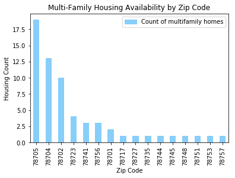
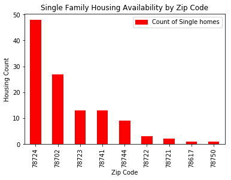

# Housing Affordability Analysis


```python
#import code dependencies
import pandas as pd
pd.options.display.float_format = '{:.0f}'.format
import numpy as np
import matplotlib.pyplot as plt
import matplotlib.patches as mpatches
import os
import csv
from functools import reduce

```


```python
#read CSV and create dataframe
AHI_df = pd.read_csv('1 - Raw Data/AHI_DATA.csv')

#select applicable fields
AHI_df = AHI_df[['Zip Code','Unit Type', 'Housing Type', 'Status', 'Affordability Start Year']]
AHI_df= AHI_df.dropna(how = 'any')

#convert datatype to make it usable
AHI_df['Zip Code'] = AHI_df['Zip Code'].astype(np.int64)

#filter to only completed projects
# filtered_AHI_df = AHI_df[(AHI_df['Status']=='Project Complete')]
filtered_AHI_df = AHI_df[(AHI_df['Affordability Start Year']>=2012)]


#group by zip code
zipGroupBy_df = filtered_AHI_df.groupby(["Zip Code"])

#count each unit type and rename column
unitCount_df = pd.DataFrame(zipGroupBy_df['Unit Type'].value_counts())
unitCount_df2 = unitCount_df.rename(columns={'Unit Type': 'Count_by_Unit_Type'})

```


```python
unitCount_df2.columns
```


    Index(['Count_by_Unit_Type'], dtype='object')


```python
#reset index
unitCount_df2.reset_index(inplace=True)
```


```python
#calculate the data spread by unit type
unitCount_df2.groupby('Unit Type').sum()["Count_by_Unit_Type"]/unitCount_df2['Count_by_Unit_Type'].sum()*100
```


    Unit Type
    ADU              1
    Duplex           4
    FourPlex         3
    Multifamily     32
    Single Family   60
    Name: Count_by_Unit_Type, dtype: float64


```python
#create dataframes by unit types

multifam_filtered_df = unitCount_df2[(unitCount_df2['Unit Type']=="Multifamily")]
singlefam_filtered_df = unitCount_df2[(unitCount_df2['Unit Type']=="Single Family")]
```


```python
#sort count from greatest to least
multifam_sorted_df = multifam_filtered_df.sort_values("Count_by_Unit_Type", ascending = False)
singlefam_sorted_df = singlefam_filtered_df.sort_values("Count_by_Unit_Type", ascending = False)
```


```python
#print datafram
multifam_sorted_df
```


<div>
<style>
    .dataframe thead tr:only-child th {
        text-align: right;
    }

    .dataframe thead th {
        text-align: left;
    }

    .dataframe tbody tr th {
        vertical-align: top;
    }
</style>
<table border="1" class="dataframe">
  <thead>
    <tr style="text-align: right;">
      <th></th>
      <th>Zip Code</th>
      <th>Unit Type</th>
      <th>Count_by_Unit_Type</th>
    </tr>
  </thead>
  <tbody>
    <tr>
      <th>6</th>
      <td>78705</td>
      <td>Multifamily</td>
      <td>19</td>
    </tr>
    <tr>
      <th>5</th>
      <td>78704</td>
      <td>Multifamily</td>
      <td>13</td>
    </tr>
    <tr>
      <th>3</th>
      <td>78702</td>
      <td>Multifamily</td>
      <td>10</td>
    </tr>
    <tr>
      <th>12</th>
      <td>78723</td>
      <td>Multifamily</td>
      <td>4</td>
    </tr>
    <tr>
      <th>18</th>
      <td>78741</td>
      <td>Multifamily</td>
      <td>3</td>
    </tr>
    <tr>
      <th>30</th>
      <td>78756</td>
      <td>Multifamily</td>
      <td>3</td>
    </tr>
    <tr>
      <th>1</th>
      <td>78701</td>
      <td>Multifamily</td>
      <td>2</td>
    </tr>
    <tr>
      <th>7</th>
      <td>78717</td>
      <td>Multifamily</td>
      <td>1</td>
    </tr>
    <tr>
      <th>15</th>
      <td>78727</td>
      <td>Multifamily</td>
      <td>1</td>
    </tr>
    <tr>
      <th>16</th>
      <td>78735</td>
      <td>Multifamily</td>
      <td>1</td>
    </tr>
    <tr>
      <th>20</th>
      <td>78744</td>
      <td>Multifamily</td>
      <td>1</td>
    </tr>
    <tr>
      <th>22</th>
      <td>78745</td>
      <td>Multifamily</td>
      <td>1</td>
    </tr>
    <tr>
      <th>24</th>
      <td>78748</td>
      <td>Multifamily</td>
      <td>1</td>
    </tr>
    <tr>
      <th>27</th>
      <td>78751</td>
      <td>Multifamily</td>
      <td>1</td>
    </tr>
    <tr>
      <th>29</th>
      <td>78753</td>
      <td>Multifamily</td>
      <td>1</td>
    </tr>
    <tr>
      <th>31</th>
      <td>78757</td>
      <td>Multifamily</td>
      <td>1</td>
    </tr>
  </tbody>
</table>
</div>


```python
#print dataframe
singlefam_sorted_df
```


<div>
<style>
    .dataframe thead tr:only-child th {
        text-align: right;
    }

    .dataframe thead th {
        text-align: left;
    }

    .dataframe tbody tr th {
        vertical-align: top;
    }
</style>
<table border="1" class="dataframe">
  <thead>
    <tr style="text-align: right;">
      <th></th>
      <th>Zip Code</th>
      <th>Unit Type</th>
      <th>Count_by_Unit_Type</th>
    </tr>
  </thead>
  <tbody>
    <tr>
      <th>14</th>
      <td>78724</td>
      <td>Single Family</td>
      <td>48</td>
    </tr>
    <tr>
      <th>2</th>
      <td>78702</td>
      <td>Single Family</td>
      <td>27</td>
    </tr>
    <tr>
      <th>11</th>
      <td>78723</td>
      <td>Single Family</td>
      <td>13</td>
    </tr>
    <tr>
      <th>17</th>
      <td>78741</td>
      <td>Single Family</td>
      <td>13</td>
    </tr>
    <tr>
      <th>19</th>
      <td>78744</td>
      <td>Single Family</td>
      <td>9</td>
    </tr>
    <tr>
      <th>9</th>
      <td>78722</td>
      <td>Single Family</td>
      <td>3</td>
    </tr>
    <tr>
      <th>8</th>
      <td>78721</td>
      <td>Single Family</td>
      <td>2</td>
    </tr>
    <tr>
      <th>0</th>
      <td>78617</td>
      <td>Single Family</td>
      <td>1</td>
    </tr>
    <tr>
      <th>25</th>
      <td>78750</td>
      <td>Single Family</td>
      <td>1</td>
    </tr>
  </tbody>
</table>
</div>


```python
#plot multifamily bar graph showing count by zip

plt.figure(figsize=(12, 10))

fig = multifam_sorted_df.plot.bar(x='Zip Code', y='Count_by_Unit_Type', color = 'lightskyblue')

fig.set_title("Multi-Family Housing Availability by Zip Code")

fig.set_xlabel("Zip Code")

fig.set_ylabel("Housing Count")

blue_patch = mpatches.Patch(color='lightskyblue', label='Count of multifamily homes')
plt.legend(handles=[blue_patch])

imagepathprotocol = "3 - Outputs/bar_plot_multifamily_analysis.png"
plt.savefig(imagepathprotocol, bbox_inches='tight')

plt.show()
```


    <matplotlib.figure.Figure at 0x1166ac9b0>





```python
#plot single family bar graph showing count by zip
plt.figure(figsize=(12, 10))

fig = singlefam_sorted_df.plot.bar(x='Zip Code', y='Count_by_Unit_Type', color = 'r')

fig.set_title("Single Family Housing Availability by Zip Code")

fig.set_xlabel("Zip Code")

fig.set_ylabel("Housing Count")

red_patch = mpatches.Patch(color='r', label='Count of Single homes')
plt.legend(handles=[red_patch])

imagepathprotocol2 = "3 - Outputs/bar_plot_singlefamily_analysis.png"
plt.savefig(imagepathprotocol2, bbox_inches='tight')

plt.show()
```


    <matplotlib.figure.Figure at 0x11100eda0>





```python
#save df as csv
singlefam_sorted_df.to_csv("2 - Clean Data/singlefam_sorted_df.csv", encoding="utf-8")
multifam_sorted_df.to_csv("2 - Clean Data/multifam_sorted_df.csv", encoding="utf-8")
```
